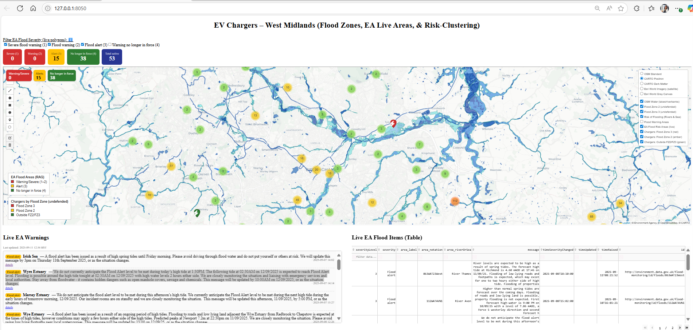
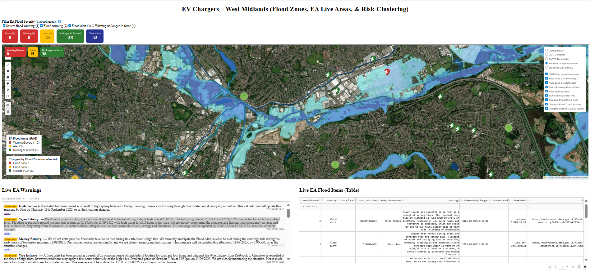
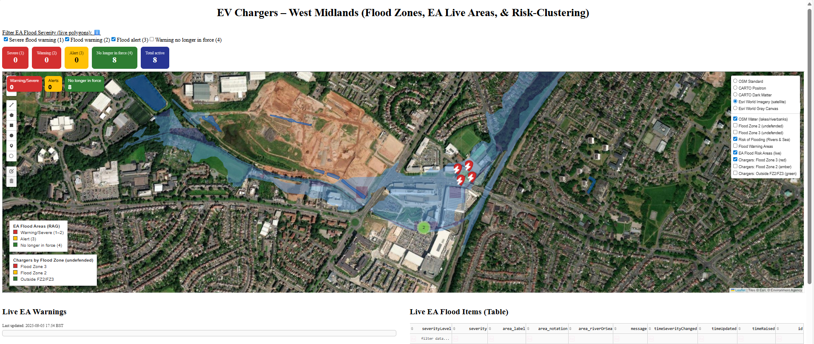
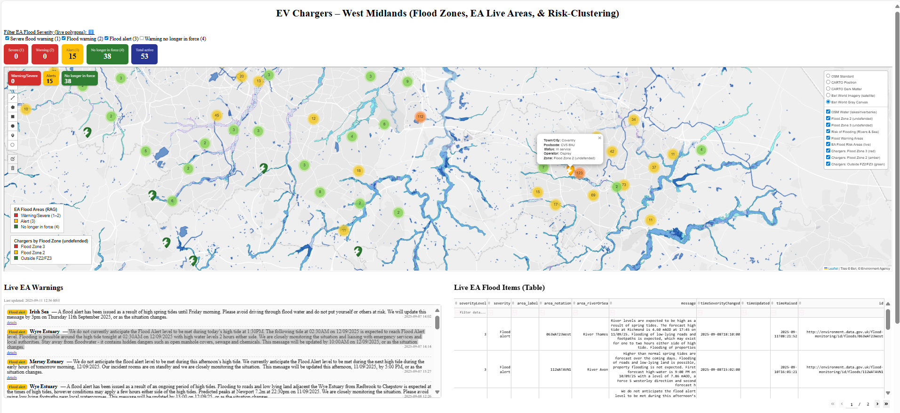
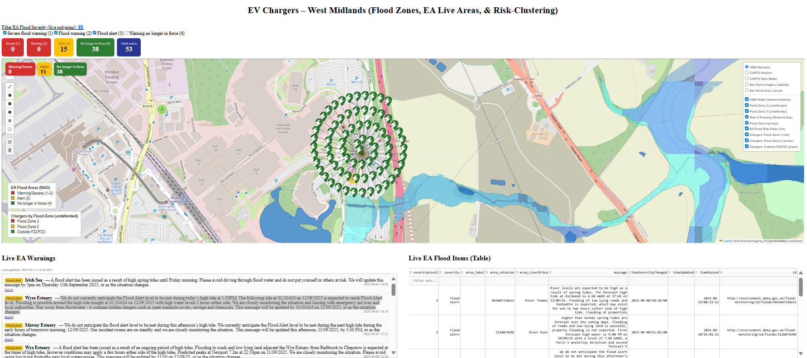
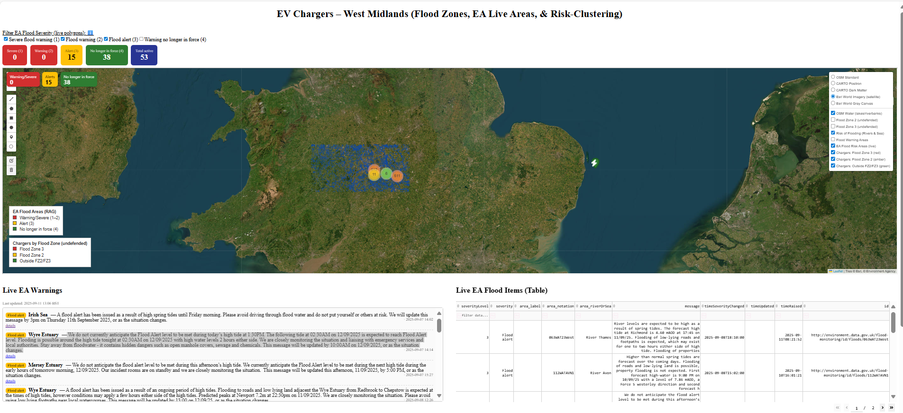

# AquaEV-West Midlands
A Dash app that maps EV charging points across the West Midlands and overlays live Environment Agency (EA) flood warnings, Flood Zone polygons (undefended), OSM water bodies, and light analytics.
# EV Chargers & Flood Risk — West Midlands


[](https://www.python.org/)
[](https://dash.plotly.com/)
[](LICENSE)
[](http://www.nationalarchives.gov.uk/doc/open-government-licence/version/3/)
[](https://www.openstreetmap.org/copyright)

A Dash + Folium web app that maps EV charging points across the West Midlands and overlays:

- **Live Environment Agency (EA) flood warnings** (polled every 60s).  
- **Flood Zone 2 & 3 polygons (undefended, via EA WFS)**.  
- **OpenStreetMap water bodies** (via Overpass API).  
- **Time-series analytics** of charger installations.  
- **Interactive polygon upload (GeoJSON)** to spatially filter chargers.  

Chargers are clustered and colour-coded by Flood Zone classification (FZ3 → FZ2 → outside).
---
## Attribution 
- 'this uses Environment Agency flood and river level data from the real-time data API (Beta)'
   https://environment.data.gov.uk/flood-monitoring/doc/reference
---

## Screenshots

### Full dashboard with EA flood warnings


### Flood warnings and charger clustering


### Charger points and Flood Zone overlay


### EA live warnings + chargers in at-risk areas


### Detailed map with water overlays


### Charger clustering in flood zones


### Regional overview


---

## Features
- **Live EA warnings & areas** with RAG styling, KPIs, tooltips, and table.  
- **Flood Zone unions** classify chargers spatially (undefended extents).  
- **OSM water overlays** (rivers, lakes, banks).  
- **Stacked time-series** of charger installs by town; filters for *status* and *payment*.  
- **User polygon upload** to refine map and analytics.  
---

## Repository contents
- `ons_evapp_west_midlands.py` — single-file Dash app with Folium map, EA overlays, EA feed, KPIs, time-series charts, and polygon upload.  
---
## Colab Notebook Version 

[Colab URL](https://colab.research.google.com/drive/1muu2wlGo1XIVPCUEs2xgWeyD_XuQ_r75?usp=sharing)

## Installation
```bash
git clone https://github.com/<your-repo>/ev-flood-risk.git
cd ev-flood-risk
pip install dash pandas geopandas folium shapely requests plotly
